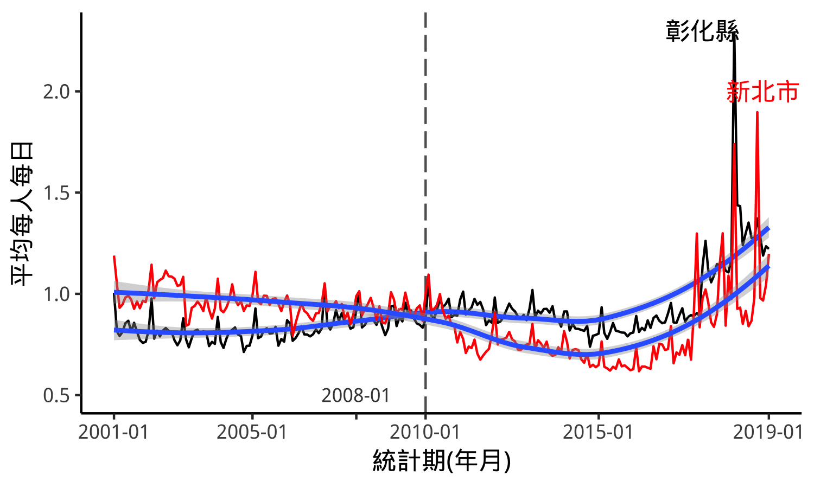

---
output:
  pdf_document: default
  html_document: default
---
# 新北市垃圾隨袋徵收效果-以Synthetic Control Method檢視

## 摘要
新北市政府自2018年開始部分區域試辦、2010年12月全面實施垃圾費隨袋徵收，此報告將探討

</img>

$Y_{1t}^{N}$
$Y_{1t}^{T}$
$$\alpha_{1t}= Y_{1t}^{I} - Y_{1t}^{N}$$
$U_{i}$ : ($\gamma \times 1$)     
($T_{0} \times 1$) K = $(k_{1},...,k_{T_{0}})^{'}$    
$Y_{i}^{k} = \sum_{s=1}^{T_{0}}k_{s}Y_{is}$    
W = ( $w_{2},...,w_{J+1}$ ) such that $w_{j}\geq 0$    
for j=2,...,J+1 and $\sum_{j=2}^{J+1} w_{i}=1$    

$W^{*} such$  $that$   
1) $\sum_{j=2}^{J+1} w_{j}^{*}Y_{j}^{K_{1}} = Y_{1}^{K_{1}} ... \sum_{j=2}^{J+1} w_{j}^{*}Y_{j}^{K_{M}} = Y_{1}^{K_{M}}$   
2) $\sum_{j=2}^{J+1} w_{j}^{*}U_{j} = U_{1}$    

$\hat{\alpha}_{1t} = Y_{1t} - \sum_{j=2}^{J+1}w_{j}^{*}Y_{jt}$  $for$  $t =T_{0}+1,...,T$    

$\mid\mid X_{1} - X_{0}W\mid\mid_{v} = \sqrt{(X_{1}-X_{0}W)^{'}V(X_{1}-X_{0}W)}$    
$X_{1} = (U_{1}^{'},\bar{Y}_{1}^{K_{1}},...,\bar{Y}_{1}^{K_{1}})$

  
